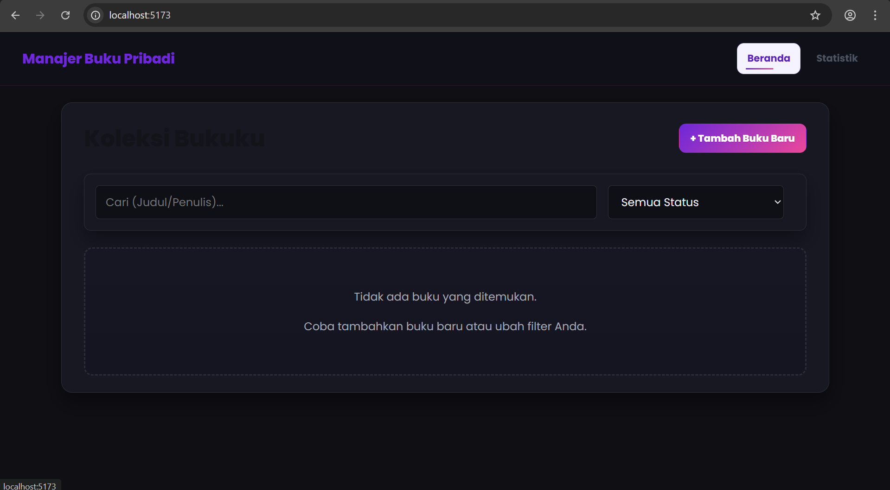
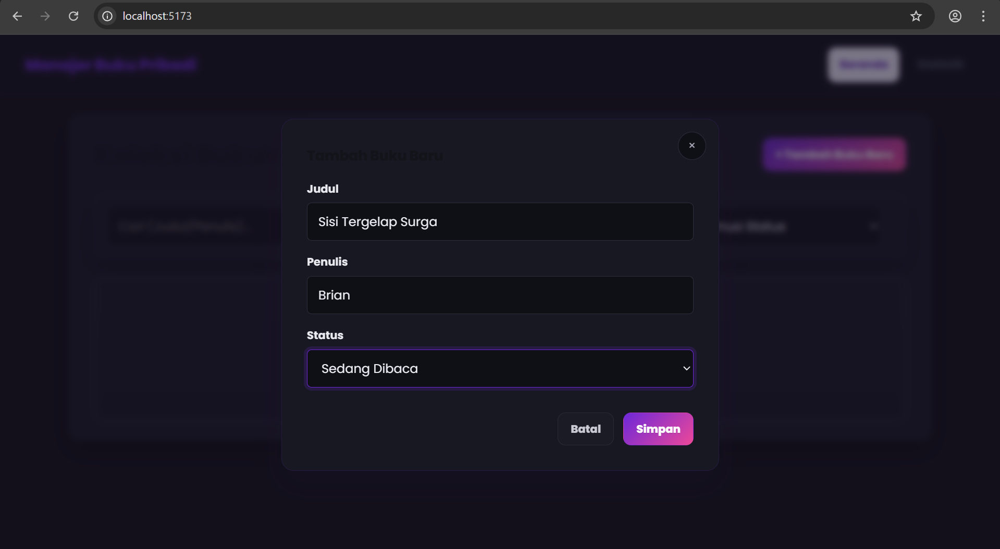

# 📚 BukuKu — Pengelola Koleksi Bacaan

Aplikasi **React** untuk merapikan koleksi buku pribadimu. Kamu bisa:
- menambahkan buku baru,
- mengedit detail,
- menghapus item,
- menyaring berdasarkan status: **Dimiliki**, **Sedang Dibaca**, **Ingin Dibeli**.

Proyek ini dibuat sebagai latihan React modern dengan state global via **Context**, **custom hooks**, dan **routing** yang rapi. Desain menggunakan tema **Violet–Magenta**, mendukung **dark mode**, dan micro-interactions (hover/tilt, ripple tombol, shimmer badge).

---

## 🖼️ Cuplikan Antarmuka

### Beranda
Filter, kolom pencarian, dan daftar koleksi dalam satu tempat.



### Modal Tambah / Edit
Form dengan validasi untuk memastikan input penting terisi.




---

## 🧩 Fitur Utama

- **Manajemen Koleksi**: tambah/ubah/hapus buku.
- **Cari & Filter**: by judul/penulis + filter status.
- **Statistik**: total, dimiliki, sedang dibaca, ingin dibeli (dihitung efisien).
- **Persisten**: data tersimpan di `localStorage`.
- **UI Interaktif**: ripple tombol, tilt card, shimmer badge, underline animasi di navbar.
- **Aksesibilitas**: `:focus-visible`, dukungan **dark mode** & **reduced motion**.

---

## 🛠️ Teknologi

- React (komponen fungsional)
- React Router (`react-router-dom`)
- Context API (state global)
- Custom Hooks (`useLocalStorage`, `useBookStats`)
- Vite (dev server)
- Vitest + React Testing Library (pengujian)

---

## 🚀 Instalasi

### 1) Prasyarat
- **Node.js** versi 16 atau lebih baru

### 2) Setup Proyek
```bash
git clone <url-repo-anda>
cd manajer-buku
npm install
````

(Opsional, jika belum ada di `package.json`)

```bash
npm install react-router-dom
```

### 3) Menjalankan Aplikasi

```bash
npm run dev
```

Buka alamat yang ditampilkan (umumnya `http://localhost:5173`).

---

## 🧱 Struktur Direktori (ringkas)

```
src/
├─ components/
│  ├─ BookItem.jsx
│  ├─ BookList.jsx
│  ├─ BookFilter.jsx
│  ├─ BookForm.jsx
│  ├─ Modal.jsx
│  └─ StatsCard.jsx
├─ context/
│  └─ BookContext.jsx
├─ hooks/
│  ├─ useLocalStorage.jsx
│  └─ useBookStats.jsx
├─ pages/
│  ├─ Home.jsx
│  └─ Stats.jsx
├─ App.jsx
├─ main.jsx
├─ index.css
└─ App.css
```

---

## 🧠 Arsitektur React

### Komponen & Props

Komponen dipisah sesuai fungsi: item (`BookItem`), daftar (`BookList`), filter (`BookFilter`), formulir (`BookForm`), modal (`Modal`), dan kartu statistik (`StatsCard`).

### Hooks

* **`useState`**: state lokal (form, toggle modal).
* **`useEffect`**: di **`useLocalStorage`** untuk sinkron `localStorage`.
* **`useMemo`**: di **`useBookStats`** agar hitung statistik tetap ringan.

### Context API — `BookContext.jsx`

`BookProvider` memasok:

* data buku & `filteredBooks`
* aksi `addBook`, `updateBook`, `deleteBook`
* state filter (`searchTerm`, `status`)
  Sehingga prop drilling tidak diperlukan.

### Routing — `react-router-dom`

* Rute `/` (Beranda) dan `/stats` (Statistik)
* Menggunakan `createBrowserRouter`, `<RouterProvider>`, `<Outlet>`, `<Link>`

### Validasi Form

`BookForm` memiliki `validateForm` untuk memastikan **Judul** & **Penulis** wajib diisi sebelum submit.

---

## 🧪 Testing

Konfigurasi menggunakan **Vitest** + **React Testing Library**.

### Instal alat tes (sekali saja)

```bash
npm install --save-dev vitest jsdom @testing-library/react @testing-library/user-event @testing-library/jest-dom
```

### Menjalankan tes

```bash
npm test
```

Cakupan uji meliputi:

* Render komponen
* Interaksi pengguna (ketik & klik)
* Validasi error form
* Logika context (tambah/ubah/hapus/filter)

---

## 🎨 Catatan Desain

* Tema **Violet–Magenta** dengan tipografi **Poppins**.
* Komponen siap **dark mode** otomatis dan **reduced motion**.
* Variabel CSS di `:root` memudahkan kustomisasi tema/densitas.

---

## 🗺️ Roadmap

* [ ] Impor/ekspor data (CSV/JSON)
* [ ] Progres baca (persentase)
* [ ] Tag/kategori buku
* [ ] Penyortiran (judul/penulis/tanggal)

---

## 🙌 Kontribusi

Silakan buka **issue** atau **PR** untuk perbaikan bug, peningkatan aksesibilitas, atau fitur kecil. Pastikan lulus lint & test sebelum mengirim PR.

## 📄 Lisensi

Bebas digunakan untuk belajar dan proyek pribadi. Untuk kebutuhan komersial, sesuaikan lisensi sesuai kebijakan tim/proyek.

```
```
