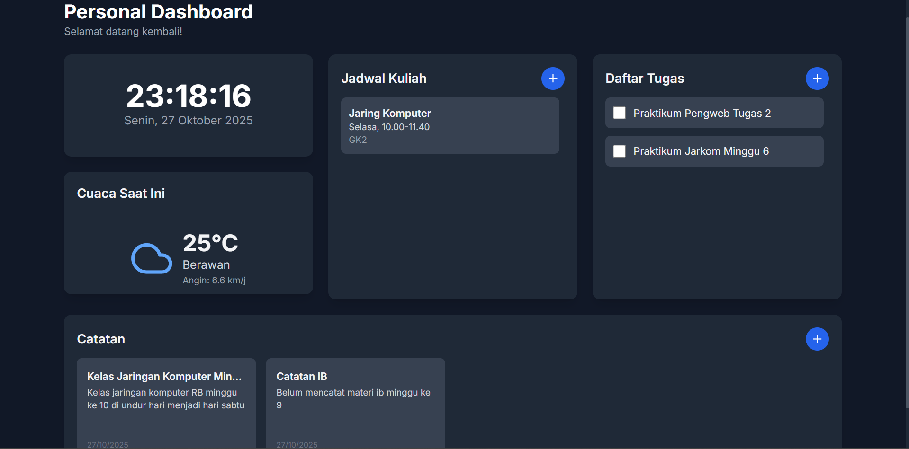
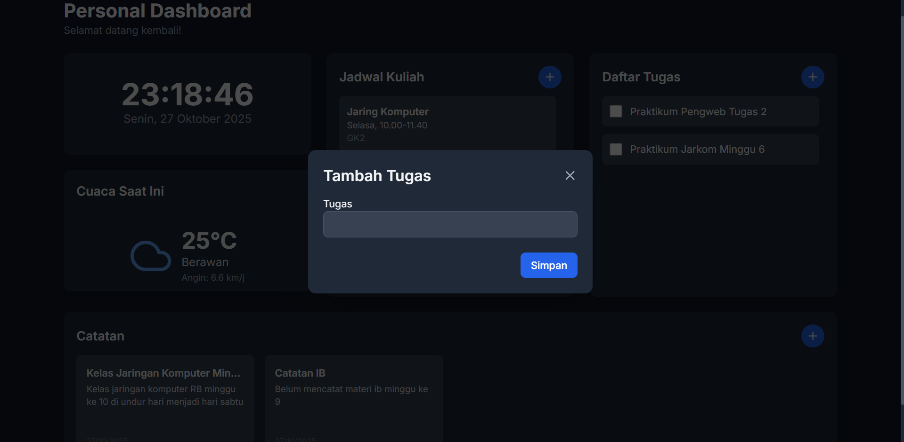
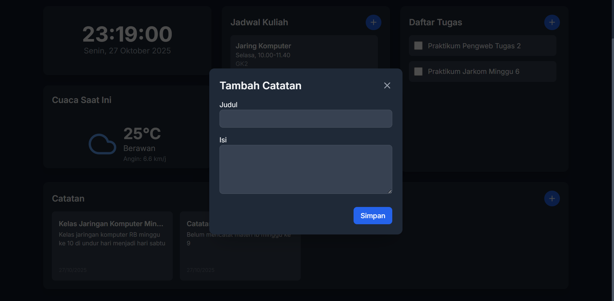

# 🧭 Personal Dashboard Web App

## 📌 Deskripsi Singkat
Aplikasi **Personal Dashboard** ini merupakan proyek berbasis **JavaScript ES6+** yang berfungsi untuk membantu pengguna dalam mengelola aktivitas sehari-hari seperti **menyimpan catatan, jadwal, dan tugas harian**.  
Aplikasi bersifat **interaktif**, memungkinkan pengguna **menambah, mengedit, dan menghapus** data secara langsung di tampilan web.

---

## ⚙️ Fitur-Fitur Aplikasi
1. 🗓️ **Manajemen Jadwal / Tugas**
   - Pengguna dapat menambah daftar tugas baru melalui input form.  
   - Setiap tugas dapat dihapus atau diperbarui secara langsung.
2. 🗒️ **Catatan Pribadi**
   - Menyimpan catatan singkat yang bisa diedit sesuai kebutuhan.
3. ⏰ **Informasi Waktu**
   - Menampilkan waktu dan tanggal terkini secara real-time menggunakan JavaScript.
4. 🌤️ **Informasi Cuaca (opsional)**
   - Mengambil data cuaca berdasarkan lokasi pengguna *(jika API diaktifkan)*.
5. 🎨 **Tampilan Interaktif**
   - Menggunakan animasi transisi halus dengan **CSS modern (Flexbox, Grid, dan Animation)**.

---

## 🖼️ Screenshot Aplikasi
Berikut contoh tampilan aplikasi yang sudah jadi:

| Halaman Utama | Tambah Tugas | Catatan |
|:--------------:|:-------------:|:---------:|
|  |  |  |

## 🧩 Fitur-Fitur Modern JavaScript (ES6+) yang Diimplementasikan
Aplikasi ini menggunakan berbagai fitur **JavaScript generasi terbaru (ES6+)**, di antaranya:

| Fitur ES6+ | Implementasi dalam kode |
|-------------|--------------------------|
| **`let` dan `const`** | Digunakan untuk deklarasi variabel yang berubah (`let`) dan yang tetap (`const`) seperti elemen DOM dan fungsi. |
| **Arrow Function (`()=>{}`)** | Terdapat minimal **3 arrow function**: `renderTasks`, `addTask`, dan `deleteTask`. |
| **Template Literal** | Digunakan untuk menampilkan teks dinamis di dalam HTML seperti `` `${task}` ``. |
| **Array Method (`forEach`, `push`, `splice`)** | Mengelola daftar tugas dengan metode array modern. |
| **Event Listener (`addEventListener`)** | Menangani aksi pengguna seperti menambah dan menghapus tugas. |
| **Modularisasi File JS** | Struktur kode dipisahkan menjadi `main.js` (inisialisasi event) dan `app.js` (logika aplikasi). |
| **DOM Manipulation Modern** | Menggunakan `querySelector`, `createElement`, dan `innerHTML` untuk memperbarui tampilan dinamis. |

---

